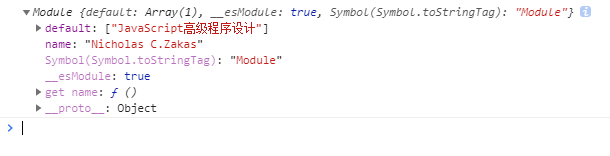

# Bundle Analysis


webpack 打包后的文件如下，省略中间部分逻辑代码，可以看到是一个自执行函数，传入了一个对象，该对象的键 `./src/index.js` 和 `./src/title.js` 都是文件路径，值为导出的模块。

```js
// webpackBootstrap
(function (modules) {
  // ...
  // ...
  // ...
    
  // Load entry module and return exports
  return __webpack_require__((__webpack_require__.s = "./src/index.js"));
    
})({
  "./src/index.js": function (module, exports, __webpack_require__) {
    const info = __webpack_require__(/*! ./title */ "./src/title.js");

    console.log(info);
  },

  "./src/title.js": function (module, exports) {
    module.exports = {
      name: "Nicholas C.Zakas",
      books: ["JavaScript高级程序设计"],
    };
  },
});

```


接下来，逐个分析 `bundle.js` 中各个函数的功能。


## \__webpack_require__ 函数

内部实现的一个自定义模块引入函数

- `installedModules` 用于缓存已经加载过的模块，根据 `moduleId` 存储模块导出内容
  - **i**: 模块id
  - **l**: 是否 loaded
  - **exports**: 模块导出的对象
  
- `modules[moduleId].call(module.exports, module, module.exports, __webpack_require__);` 

  - 执行模块函数，比如这个：

    ```js
      function (module, exports, __webpack_require__) {
          const title = __webpack_require__(/*! ./title */ "./src/title.js");
      
          console.log(title);
        },
    ```

  - `call `函数传入 `module.exports` 用于绑定执行函数内部 `this` 指针，后续再传入三个函数 `module`, `module.exports`, `__webpack_require__`

- 上述执行模块函数执行后会给传入的 `module` 参数的`module.exports` 进行赋值，改变 `__webpack_require__` 中 `module ` 对象，最后进行导出；

```js
 	// The module cache
 	var installedModules = {};

 	// The require function
 	function __webpack_require__(moduleId) {

 		// Check if module is in cache
 		if(installedModules[moduleId]) {
 			return installedModules[moduleId].exports;
 		}
 		// Create a new module (and put it into the cache)
 		var module = installedModules[moduleId] = {
 			i: moduleId,
 			l: false,
 			exports: {}
 		};

 		// Execute the module function
 		modules[moduleId].call(module.exports, module, module.exports, __webpack_require__);

 		// Flag the module as loaded
 		module.l = true;

 		// Return the exports of the module
 		return module.exports;
 	}
```


## \__webpack_require__.d 函数

- 给 `export` 对象定义新属性，属性值是一个 `getter ` 函数

```js
 	// define getter function for harmony exports
 	__webpack_require__.d = function(exports, name, getter) {
 		if(!__webpack_require__.o(exports, name)) {
 			Object.defineProperty(exports, name, { enumerable: true, get: getter });
 		}
 	};
```


## \__webpack_require__.r 函数

- 定义 ES6 模块，在 `exports` 对象上定义 `__esModule` 属性；

- 给传入的对象定义 `__esModule` 属性，并且改变对象的 `toStringTag` 属性值为 `Module`，使得 `Object.prototype.toString.call(exports)` 值为 `[object Module]`

```js
// define __esModule on exports
__webpack_require__.r = function(exports) {
    if(typeof Symbol !== 'undefined' && Symbol.toStringTag) {
        Object.defineProperty(exports, Symbol.toStringTag, { value: 'Module' });
    }
    Object.defineProperty(exports, '__esModule', { value: true });
};
```


## \__webpack_require__.t

- 对这个逻辑很无语，不想解释，使用 & 运算符做逻辑判断真的过份！

```js
 	// create a fake namespace object
 	// mode & 1: value is a module id, require it
 	// mode & 2: merge all properties of value into the ns
 	// mode & 4: return value when already ns object
 	// mode & 8|1: behave like require
 	__webpack_require__.t = function(value, mode) {
 		if(mode & 1) value = __webpack_require__(value);
 		if(mode & 8) return value;
 		if((mode & 4) && typeof value === 'object' && value && value.__esModule) return value;
 		var ns = Object.create(null);
 		__webpack_require__.r(ns);
 		Object.defineProperty(ns, 'default', { enumerable: true, value: value });
 		if(mode & 2 && typeof value != 'string') for(var key in value) __webpack_require__.d(ns, key, function(key) { return value[key]; }.bind(null, key));
 		return ns;
 	};
```


## \__webpack_require__.n

- 定义默认导出，在 调用 `__webpack_require__.n` 返回的对象的 `a` 属性可以找到默认导出。

```js
// getDefaultExport function for compatibility with non-harmony modules
__webpack_require__.n = function(module) {
    var getter = module && module.__esModule ?
        function getDefault() { return module['default']; } :
    function getModuleExports() { return module; };
    __webpack_require__.d(getter, 'a', getter);
    return getter;
};
```


##  \__webpack_require__.o 函数

- `hasOwnProperty ` 函数的包装

```js
// Object.prototype.hasOwnProperty.call
__webpack_require__.o = function(object, property) { return Object.prototype.hasOwnProperty.call(object, property); };


```

## \__webpack_require__.e 函数

- 接收 `chunkId` ，返回 Promise对象
- `installedChunkData` 保存了[resolve, reject, promise]
- body 中插入 script 标签

```js
// This file contains only the entry chunk.
// The chunk loading function for additional chunks
__webpack_require__.e = function requireEnsure(chunkId) {
  var promises = [];

  // JSONP chunk loading for javascript

  var installedChunkData = installedChunks[chunkId];
  if (installedChunkData !== 0) {
    // 0 means "already installed".

    // a Promise means "currently loading".
    if (installedChunkData) {
      promises.push(installedChunkData[2]);
    } else {
      // setup Promise in chunk cache
      var promise = new Promise(function (resolve, reject) {
        installedChunkData = installedChunks[chunkId] = [resolve, reject];
      });
      promises.push((installedChunkData[2] = promise));

      // start chunk loading
      var script = document.createElement("script");
      var onScriptComplete;

      script.charset = "utf-8";
      script.timeout = 120;
      if (__webpack_require__.nc) {
        script.setAttribute("nonce", __webpack_require__.nc);
      }
      script.src = jsonpScriptSrc(chunkId);

      // create error before stack unwound to get useful stacktrace later
      var error = new Error();
      onScriptComplete = function (event) {
        // avoid mem leaks in IE.
        script.onerror = script.onload = null;
        clearTimeout(timeout);
        var chunk = installedChunks[chunkId];
        if (chunk !== 0) {
          if (chunk) {
            var errorType =
              event && (event.type === "load" ? "missing" : event.type);
            var realSrc = event && event.target && event.target.src;
            error.message =
              "Loading chunk " +
              chunkId +
              " failed.\n(" +
              errorType +
              ": " +
              realSrc +
              ")";
            error.name = "ChunkLoadError";
            error.type = errorType;
            error.request = realSrc;
            chunk[1](error);
          }
          installedChunks[chunkId] = undefined;
        }
      };
      var timeout = setTimeout(function () {
        onScriptComplete({ type: "timeout", target: script });
      }, 120000);
      script.onerror = script.onload = onScriptComplete;
      document.head.appendChild(script);
    }
  }
  return Promise.all(promises);
};

```


## 同步加载模块

### CommonJS 加载 CommonJS

```js
// index.js
const info = require("./title");

console.log(info);
```

```js
// title.js
module.exports = {
  name: "Nicholas C.Zakas",
  books: ['JavaScript高级程序设计']
}
```

```js
// bundle.js
(function (modules) {
  // ...
  // ...
  // ...
    
  // Load entry module and return exports
  return __webpack_require__((__webpack_require__.s = "./src/index.js"));
    
})({
  "./src/index.js": function (module, exports, __webpack_require__) {
    const info = __webpack_require__(/*! ./title */ "./src/title.js");

    console.log(info);
  },

  "./src/title.js": function (module, exports) {
    module.exports = {
      name: "Nicholas C.Zakas",
      books: ["JavaScript高级程序设计"],
    };
  },
});
```

仅仅使用 webpack 内部定义的 `__webpack_require__` 函数实现了模块的导入。


### CommonJS 加载 ES6

```js
// index.js
const info = require("./title");

console.log(info);
```

```js
// title.js
export const name = "Nicholas C.Zakas";
const books = ["JavaScript高级程序设计"];
export default books;
```

```js
// bundle.js
(function (modules) {
  // ...
  // ...
  // ...
    
  // Load entry module and return exports
  return __webpack_require__((__webpack_require__.s = "./src/index.js"));
    
})({
  "./src/index.js": function (module, exports, __webpack_require__) {
    const info = __webpack_require__(/*! ./title */ "./src/title.js");

    console.log(info);
  },

  "./src/title.js": function (
    module,
    __webpack_exports__,
    __webpack_require__
  ) {
    "use strict";
    __webpack_require__.r(__webpack_exports__);
    __webpack_require__.d(__webpack_exports__, "name", function () {
      return name;
    });
    const name = "Nicholas C.Zakas";
    const books = ["JavaScript高级程序设计"];
    /* harmony default export */ __webpack_exports__["default"] = books;
  },
});
```

**注意：**这里在 `return name` 后 `const name` 并没有错，使用了 `Object.defineProperty` 给对象定义 get 属性时，在读取该对象的 `name` 属性时才会访问栈内存中的 `name`，所以说这里并没有错。

如下代码就是示例：

```js
let obj = {};
Object.defineProperty(obj, "name", {
  enumerable: true,
  get: function () {
    return name;
  },
});
const name = "webpack";
console.log(obj.name); // webpack
```


执行函数分析

- `__webpack_require__.r` 给 ` __webpack_exports__` 对象上定义 `__esModule` 属性并改变它的 `toStringTags` 值为 `Module`;
- `__webpack_require__.d ` 通过 `Object.defineProperty` 定义导出变量 `name ` 的 `getter`;
- 在 ` __webpack_exports__` 对象的 `default` 上定义 ES6 默认导出的值




### ES6加载ES6

```js
// index.js
import books, { name } from "./title";

console.log(books);
console.log(name);
```

```js
// title.js
export const name = "Nicholas C.Zakas";
const books = ["JavaScript高级程序设计"];
export default books;
```

```js
// bundle.js
(function (modules) {
  // ...
  // ...
  // ...
    
  // Load entry module and return exports
  return __webpack_require__((__webpack_require__.s = "./src/index.js"));
    
})({
  "./src/index.js": function (
    module,
    __webpack_exports__,
    __webpack_require__
  ) {
    "use strict";
    __webpack_require__.r(__webpack_exports__);
    /* harmony import */ var _title__WEBPACK_IMPORTED_MODULE_0__ = __webpack_require__(
      /*! ./title */ "./src/title.js"
    );

    console.log(_title__WEBPACK_IMPORTED_MODULE_0__["default"]);
    console.log(_title__WEBPACK_IMPORTED_MODULE_0__["name"]);
  },

  "./src/title.js": function (
    module,
    __webpack_exports__,
    __webpack_require__
  ) {
    "use strict";
    __webpack_require__.r(__webpack_exports__);
    /* harmony export (binding) */ __webpack_require__.d(
      __webpack_exports__,
      "name",
      function () {
        return name;
      }
    );

    const name = "Nicholas C.Zakas";
    const books = ["JavaScript高级程序设计"];
    /* harmony default export */ __webpack_exports__["default"] = books;
  },
});
```

- `./src/index.js` 函数里面也添加了 ES6 模块规则，使用了 `__webpack_require__.r` 函数给 `__webpack_exports__` 对象添加 `__esModule`
- `_title__WEBPACK_IMPORTED_MODULE_0__` 可以拿到导出对象的 `default ` 和 `name` 值


### ES6加载CommonJS

```js
// index.js
import info, { name } from "./title";

console.log(info);
console.log(name);
```

```js
// title.js
module.exports = {
  name: "Nicholas C.Zakas",
  books: ['JavaScript高级程序设计']
}
```

```js
// bundle.js
(function (modules) {
  // ...
  // ...
  // ...
    
  // Load entry module and return exports
  return __webpack_require__((__webpack_require__.s = "./src/index.js"));
    
})({
  "./src/index.js": function (
    module,
    __webpack_exports__,
    __webpack_require__
  ) {
    "use strict";
    __webpack_require__.r(__webpack_exports__);
    /* harmony import */ var _title__WEBPACK_IMPORTED_MODULE_0__ = __webpack_require__(
      /*! ./title */ "./src/title.js"
    );
    /* harmony import */ var _title__WEBPACK_IMPORTED_MODULE_0___default = /*#__PURE__*/ __webpack_require__.n(
      _title__WEBPACK_IMPORTED_MODULE_0__
    );

    console.log(_title__WEBPACK_IMPORTED_MODULE_0___default.a);
    console.log(_title__WEBPACK_IMPORTED_MODULE_0__["name"]);
  },
    
  "./src/title.js": function (module, exports) {
    module.exports = {
      name: "Nicholas C.Zakas",
      books: ["JavaScript高级程序设计"],
    };
  },
});
```

- `__webpack_require__.n` 返回了一个 `getter `，并在 getter 上定义了一个 `a` 属性作为默认导出，无论是 commonjs 的默认导出还是 ES6 的默认导出。


## 异步加载模块

采用监听按钮点击事件动态引入模块的demo。

- 使用了 `__webpack_require__.e` 做模块动态引入

- `__webpack_require__.e` 函数创建 script 标签并插入 body 使得浏览器访问 0.bundle.js

- 0.bundle.js 中调用了 `push ` 方法，然而 push 方法已经在 bundle.js 中被重写为 `webpackJsonpCallback`，调用 `push` 等于调用 `webpackJsonpCallback`，调用 `webpackJsonpCallback` 就会调用如下逻辑，使得 `promise` 被 `resolve`

- `resolve ` 了 Promise ，就可以调用 `then ` 函数的方法

  ```js
  while(resolves.length) {
  	resolves.shift()();
  }
  ```

  

```js
// title.js
module.exports = {
  name: "Nicholas C.Zakas",
  books: ['JavaScript高级程序设计']
}
```

```js
// index.js
document.getElementById("btn").addEventListener("click", () => {
  import("./title").then((res) => {
    console.log(res);
  });
});
```

打包后的文件

```js
// 0.bundle.jsjs
(window["webpackJsonp"] = window["webpackJsonp"] || []).push([
  [0],
  {
    "./src/title.js": function (module, exports) {
      module.exports = {
        name: "Nicholas C.Zakas",
        books: ["JavaScript高级程序设计"],
      };
    },
  },
]);

```

```js
// script path function
function jsonpScriptSrc(chunkId) {
  return __webpack_require__.p + "" + chunkId + ".bundle.js";
}

// This file contains only the entry chunk.
// The chunk loading function for additional chunks
__webpack_require__.e = function requireEnsure(chunkId) {}

```

